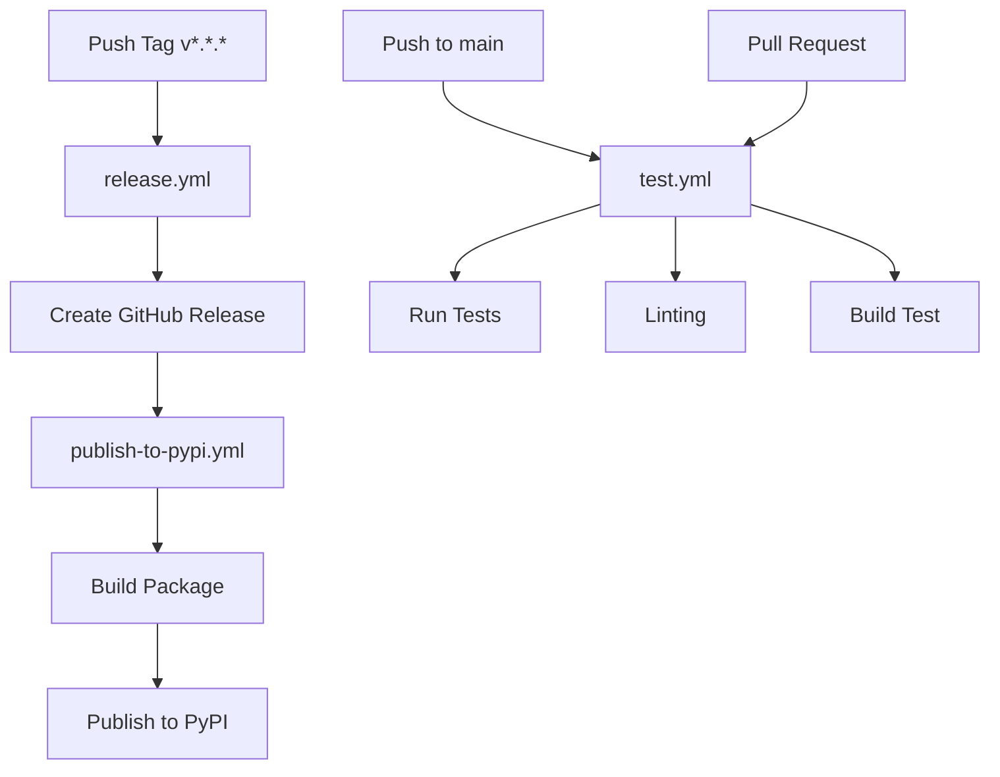

# GitHub Actions Workflows

This directory contains automated workflows for testing, releasing, and publishing the gosset-sdk package.

## Workflows

### 🧪 `test.yml` - Continuous Integration

**Triggers:**
- Push to main/master branch
- Pull requests to main/master
- Manual dispatch

**Actions:**
- Runs tests on Python 3.8-3.12
- Linting (black, flake8, mypy)
- Test package build
- Verify CLI functionality

**Status:** 

---

### 🏷️ `release.yml` - Create GitHub Release

**Triggers:**
- Push tag matching `v*.*.*` (e.g., `v0.2.0`)

**Actions:**
1. Validates tag version matches `pyproject.toml`
2. Extracts changelog from `CHANGES.md`
3. Creates GitHub Release (auto-marks pre-release for alpha/beta/rc)

**Example:**
```bash
git tag v0.2.0
git push origin v0.2.0
```

---

### 📦 `publish-to-pypi.yml` - PyPI Publishing

**Triggers:**
- GitHub Release is published
- Manual dispatch (publishes to TestPyPI)

**Actions:**
1. Builds distribution packages (wheel & source)
2. Validates packages with twine
3. Publishes to PyPI using trusted publishing
4. (Manual trigger: publishes to TestPyPI for testing)

**Requirements:**
- PyPI Trusted Publishing configured
- Or `PYPI_API_TOKEN` secret (alternative)

**Status:** 

---

## Setup Instructions

### PyPI Trusted Publishing (Recommended)

1. Go to https://pypi.org/manage/account/publishing/
2. Add a new pending publisher:
   - **PyPI Project Name**: `gosset`
   - **Owner**: your-github-username or organization
   - **Repository**: `gosset-sdk`
   - **Workflow**: `publish-to-pypi.yml`
   - **Environment**: `pypi`

### Alternative: API Token Method

1. Create API token at https://pypi.org/manage/account/token/
2. Add to GitHub Secrets:
   - Settings → Secrets and variables → Actions
   - New secret: `PYPI_API_TOKEN`
3. Modify `publish-to-pypi.yml` to use token authentication

### TestPyPI (Optional, for testing)

1. Go to https://test.pypi.org/manage/account/publishing/
2. Repeat trusted publishing setup
3. Use manual workflow dispatch to test

---

## Complete Release Process

### Quick Release (4 steps)

```bash
# 1. Update version and changelog
vim pyproject.toml CHANGES.md

# 2. Commit changes
git add pyproject.toml CHANGES.md
git commit -m "Prepare release v0.2.0"
git push origin main

# 3. Create and push tag
git tag v0.2.0
git push origin v0.2.0

# 4. Verify after ~5 minutes
pip install --upgrade gosset
```

That's it! The workflows handle:
- ✅ Version validation
- ✅ GitHub Release creation
- ✅ PyPI publication

---

## Workflow Dependencies



---

## Troubleshooting

### ❌ Version Mismatch Error

**Error:** Tag version doesn't match `pyproject.toml`

**Solution:**
```bash
# Ensure versions match
grep 'version =' pyproject.toml  # Should show same as tag
git tag -d v0.2.0  # Delete local tag
git push --delete origin v0.2.0  # Delete remote tag
# Fix version, commit, then re-tag
```

### ❌ PyPI Publishing Failed

**Error:** `403 Forbidden` or authentication error

**Solutions:**
1. Check PyPI trusted publishing is configured correctly
2. Verify repository name and workflow name match exactly
3. Ensure workflow file is on the main branch
4. Try manual token method as fallback

### ❌ Tests Failing

**Error:** Tests fail in CI but pass locally

**Solutions:**
1. Check Python version compatibility
2. Ensure all dependencies in `requirements.txt`
3. Run tests locally with same Python version: `pytest tests/`
4. Check for environment-specific issues

---

## Manual Workflow Triggers

To manually trigger workflows:

1. Go to **Actions** tab in GitHub
2. Select the workflow
3. Click **Run workflow**
4. Choose branch and run

**Useful for:**
- Testing TestPyPI publishing
- Re-running failed builds
- Testing workflow changes

---

## Maintenance

### Updating Workflows

When modifying workflows:

1. Test changes on a feature branch
2. Use `workflow_dispatch` trigger for testing
3. Merge to main after verification
4. Monitor first automated run

### Updating Python Versions

Edit `test.yml` matrix:
```yaml
matrix:
  python-version: ["3.8", "3.9", "3.10", "3.11", "3.12", "3.13"]
```

Also update:
- `pyproject.toml` classifiers
- `README.md` supported versions

---

## Additional Resources

- [GitHub Actions Documentation](https://docs.github.com/en/actions)
- [PyPI Trusted Publishing Guide](https://docs.pypi.org/trusted-publishers/)
- [Python Packaging User Guide](https://packaging.python.org/)
- [Semantic Versioning](https://semver.org/)

For detailed publishing instructions, see `PUBLISHING.md` in the repository root.

